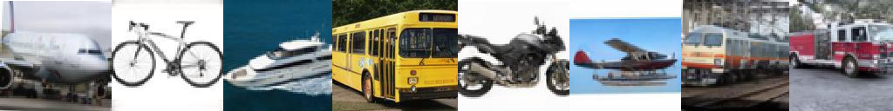

# hcaptcha-dataset
Dataset of thousands of hcaptcha images.  
Collected using https://github.com/orlov-ai/hcaptcha-collector

Manually labeled. 
Last updated: April 2022.

## Classes

airplane: 503 
bicycle: 375 
boat: 662 
motorbus: 317 
motorcycle: 733 
seaplane: 355 
train: 304 
truck: 819 

## Sizes

(128px, 128px): 3963; (144px, 144px): 105

## Info
You can use it for educational purposes (fair use). They probably result of a GAN neural network anyways.
